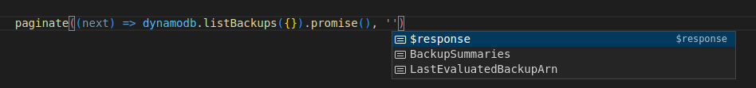

# paginate-aws

> Typesafe AWS Pagination using async generators

Useful when you need to paginate and AWS SDK call (v2/v3). Works with any aws operation with a paginationKey and uses typescript to help (but not guarantee) you have selected the correct pagination key




## Install

```bash
npm install @baselime/paginate-aws
```

## Usage
```js
import { paginate } from '@baselime/paginate-aws';

for await (const stacks of paginate((next) => cloudFormation.listStacks({ NextToken: next }).promise(), 'NextToken')) {
    console.log(stacks.StackSummaries)
    //=> [{ StackName: 'prod-just-ship-it-be-cool', ...}, ...]
}
```
## API

### paginate((next: string) => asyncAWSSDKMETHOD({ next }), paginationKey: string)

returns an async generator that paginates through the aws-sdk list method returning all the responses.


